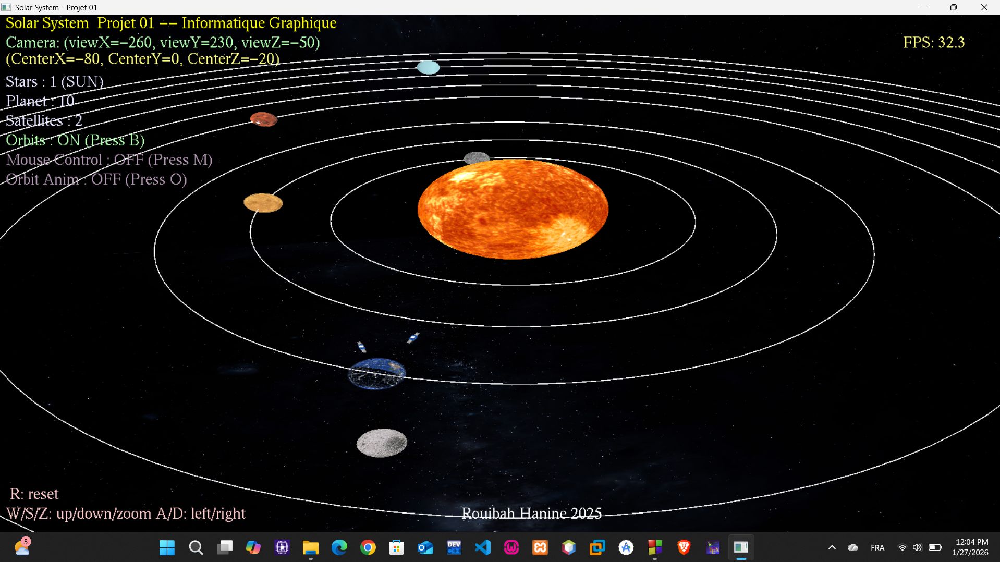
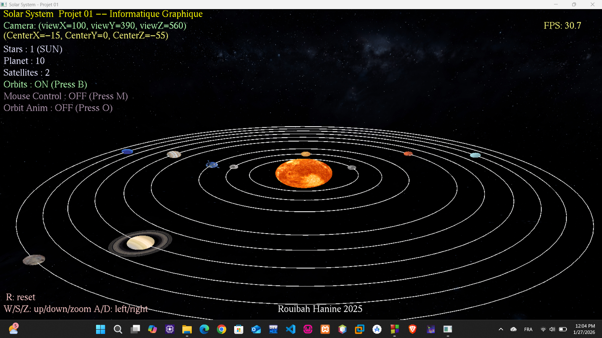
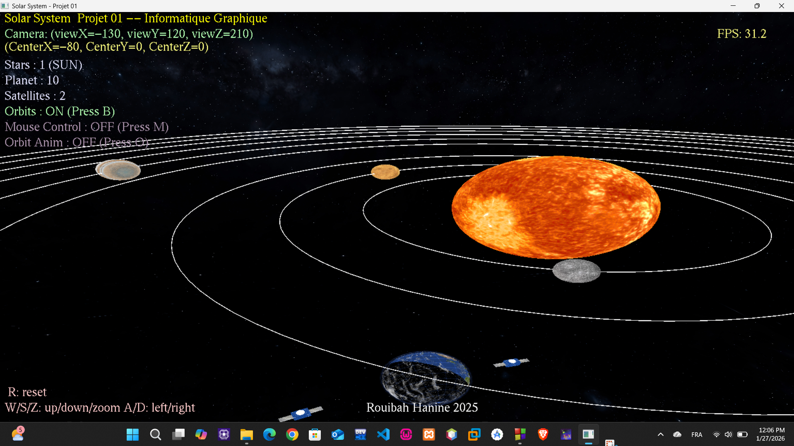

# Solar System Project

A realistic, interactive 3D solar system visualization built using **OpenGL**, **GLUT**, and **GLU**, featuring textured planets, dynamic day/night cycles, orbiting moons/satellites, Saturn's rings, Venus atmosphere, Earth clouds, skybox background, camera controls, orbit toggling, and smooth animation.

## Features

- Realistic planetary orbits and self-rotation
- Textured planets (8K/4K/2K where available) using **stb_image**
- Special effects:
  - Earth: day/night cycle with city lights + moving clouds + atmosphere glow
  - Saturn: semi-transparent textured rings
  - Venus: glowing atmosphere overlay
  - Moon and two artificial satellites orbiting Earth
- Dynamic skybox (Milky Way)
- Orbit paths visualization (toggle with `B`)
- Free camera movement (keyboard + optional mouse look)
- Automatic orbiting camera mode (toggle with `O`)
- Real-time FPS counter
- Informative HUD showing camera position, object counts, and controls

## Controls

| Key              | Action                              |
|------------------|-------------------------------------|
| **W / X / Z**    | Move camera Up / Down / Zoom Out    |
| **A / D**        | Move camera Left / Right            |
| **S**            | Zoom In                             |
| **R**            | Reset camera position               |
| **O**            | Toggle automatic camera orbit       |
| **M**            | Toggle mouse-look control           |
| **B**            | Toggle orbit lines visibility       |
| Arrow keys / F1-F2 | Alternative camera movement       |

## Requirements

- **C++ compiler** (g++, MSVC, clang)
- **OpenGL** + **GLUT** + **GLU** development libraries
  

## Project Structure 
solar-system-project/ 
├── index.cpp                # The complete source code 
├── textures/               # All planet/sky textures go here 
│   ├── 8k_sun.jpg 
│   ├── 8k_earth.jpg 
│   ├── 8k_earth_night.jpg 
│   ├── 8k_earth_clouds.jpg 
│   ├── 8k_mercury.jpg 
│   ├── 2k_mars.jpg 
│   ├── 8k_jupiter.jpg 
│   ├── 2k_saturn.jpg 
│   ├── 2k_saturn_ring_alpha.png 
│   ├── 2k_uranus.jpg 
│   ├── 2k_neptune.jpg 
│   ├── 8k_moon.jpg 
│   ├── 8k_stars_milky_way.jpg 
│   ├── panneaux.jpg        # Satellite body 
│   ├── anttenne.png        # Satellite antenna 
│   └── metal.png           # Satellite thrusters/parts 
├── screenshots/             
├── stb_image.h 
└── README.md 

Where to get Textures?
You can download high-quality planet textures from these free sources:

https://www.solarsystemscope.com/textures/

## Known Limitations / Future Improvements

No collision detection or accurate astronomical scale (artistic representation)
Performance may drop with very high-resolution textures on low-end hardware
No shader support (fixed-function pipeline – compatible with old systems)
Possible future additions:
Realistic lighting with normal maps
Comet/asteroid belt
Time acceleration control
Planet name labels in 3D

## Author

Hanine Rouibah
Created in 2025 as part of a Computer Graphics project.

## License
MIT License – feel free to use, modify, and share!
